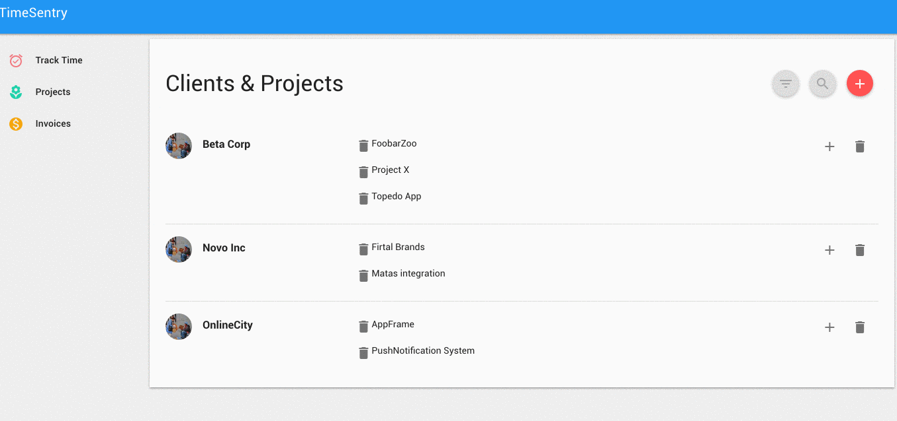

# timeSentry

timeSentry is a small timetracker that lets you track time when working on
freelance projects. The code is very rough and should still be regarded as
work in progress.

Alot of production grade concepts such as 

 * error handling
 * frontend input validation
 * test suite and ci
 * extensive commenting
 
are missing at this point in time. Below is an animation showing the project
in action

The project is build with [Flask-Potion](https://github.com/biosustain/potion), [Angularjs](https://github.com/angular/angular.js) and 
[Material Design](https://www.google.com/design/spec/material-design/introduction.html).

